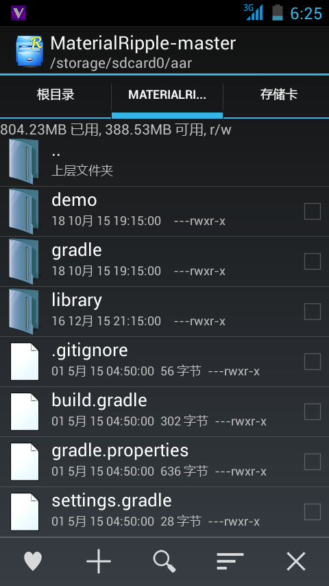

2. Gradle构造的使用
-------
### 1: Gradle构造的工程结构  
  
我们可以通过新建工程－Gradle工程来方便地建立一个Gradle工程。  
我们来看看Github上一个名为material-ripple的支持库的结构。  
  
 `build.gradle` 是Gradle的配置文件，具体内容会在下文仔细分析。  
接下来，就是这三个文件夹了：其中两个是Module，还有一个 `gradle` 文件夹是编译的工具，不需要管。  
也许还有一些文件，这些都可以在百度上找到，这里不再赘述。  
因为那两个都是Module，这里就仅对 `demo` 这个Module进行分析了，大体上都相同。  
那么我们来看看这个Module的结构  
  
如上图所示，这个Module中包含了两个需要注意的内容： `src` 和 `build.gradle` 。  
 `build.gradle` 等到下文我们再来分析。而这个 `src` 文件夹，不是指Eclipse中的 `src` ，它放的是整个工程，而不是单单的类文件。这个 `src` 文件夹的里面，是 `main` 文件夹，其内就是整个工程了。在一些被编译过的Module内，会有 `build` 文件夹，装着Eclipse中的 `bin` 和 `gen` 文件夹，就是Eclipse中的那些，编译器会自行处理，开发者不用管。另外也许还有一些文件，也可在百度找到。 `src` 中 `main` 文件夹内的结构如图。  
  
这个文件夹里面包含了两个文件夹和一个文件， `java` 文件夹就是Eclipse中的 `src` 文件夹，里面是包和类， `res` 和 `AndroidManifest.xml` ，看看名字就能明白了。这个目录下，在有些工程内，还有 `assets` 文件夹，和Eclipse是一样的。  
  
那么这些就是Gradle构造的结构分析，其实看上去和原来我们使用Eclipse构造时没有什么区别，可以用一张列表来说明：  

- Project
  - Module
    - src
      - main
        - java
        - res
        - AndroidManifest.xml
    - build
    - build.gradle
    - 其它文件
  - build.gradle
  - 其它文件
 
[下一篇>>>](./ChapterTwoTwo.md)
